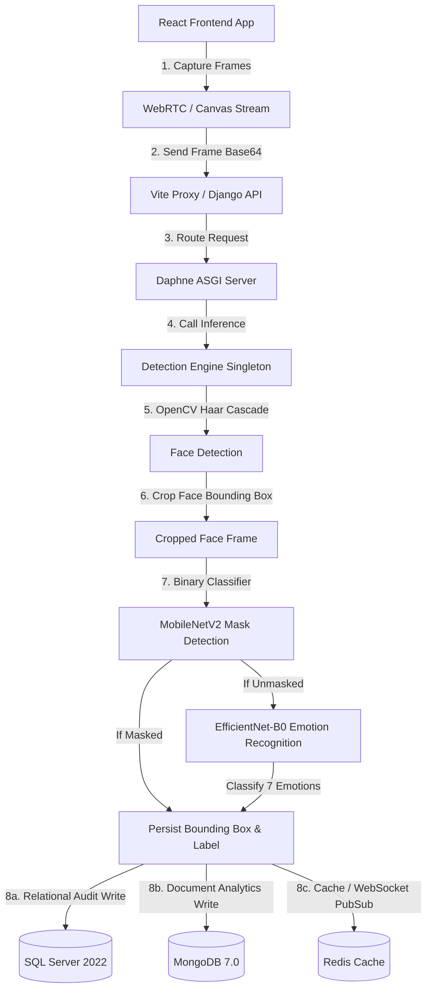

# 🧠 FaceGuard.AI — Project Documentation & Architecture Guide

Welcome to the comprehensive developer and system documentation for **FaceGuard.AI**, a production-grade deep learning full-stack system designed to perform real-time **face mask compliance monitoring** and **human emotion recognition**. 

This project implements an industry-standard **8-Step Data Preprocessing and Machine Learning Pipeline** integrated with a modern containerized web service.

---

## 📖 Table of Contents
1. [System Overview & Architecture](#-system-overview--architecture)
2. [The 8-Step Preprocessing Pipeline](#-the-8-step-preprocessing-pipeline)
3. [Deep Learning Model Architecture](#-deep-learning-model-architecture)
4. [Full-Stack Web & API Architecture](#-full-stack-web--api-architecture)
5. [Database Persistence Strategy](#-database-persistence-strategy)
6. [Project Folder Directory](#-project-folder-directory)
7. [Installation & Local Setup](#-installation--local-setup)
8. [Machine Learning Scripts Guide](#-machine-learning-scripts-guide)
9. [Automation Scripts (Windows Batch)](#-automation-scripts-windows-batch)

---

## 🏗️ System Overview & Architecture

FaceGuard.AI operates by capturing frames from a user's web camera, sending them to a Django backend server, passing the frame through a dual-model computer vision pipeline, and storing structured logs across relational and document databases.



---

## 🔄 The 8-Step Preprocessing Pipeline

The model training workflow follows a strict, step-by-step data preprocessing methodology to ensure high-quality dataset inputs, eliminate data leakage, handle outliers, and balance classes.

### Step 1: Load and Explore the Dataset
* **Emotion Dataset**: Loads **11,388** original images (48x48 pixels, grayscale) representing 7 classes (`angry`, `disgust`, `fear`, `happy`, `neutral`, `sad`, `surprise`).
* **Mask Dataset**: Loads **7,293** images representing 2 classes (`with_mask`, `without_mask`).
* **Operation**: Analyzes shapes, dimensions, color modes, and formats of all files.

### Step 2: Check for and Handle Duplicates
* **Issue**: Exact duplicate files in training, validation, or testing splits lead to data leakage and artificially inflated performance.
* **Fix**: Generates SHA-256 hashes of each image file's raw bytes. Drops duplicate records from the dataset, keeping the first occurrence.
* **Impact**: Dropped **283** duplicate emotion images (leaving **11,105**) and **300** duplicate mask images (leaving **6,993**).

### Step 3: Handle Missing and Corrupt Values
* **Issue**: Unreadable files or incomplete entries.
* **Fix**: Verifies image structure using Python's Pillow library (`PIL.Image.verify()`). Automatically drops corrupted or zero-byte files. No corrupt images were found in the current datasets.

### Step 4: Outlier Detection and Handling
* **Issue**: Extremely small or large images (by file size or dimensions) can disrupt training or cause extreme gradients.
* **Fix**: Computes Z-scores of file sizes and IQR boundaries. Outliers representing extreme anomalies (such as a 7MB text document accidentally placed in the image folder) are dropped (5 images dropped). Log-scaling (`log1p`) is applied to image dimension features for exploration.

### Step 5: Data Visualizations
Generates a suite of 8 analytical visualizations stored in [project/ml/outputs](file:///E:/AMIT%20AI/Face%20Mask%20&%20Emotion%20detection/project/ml/outputs):
* `viz1_emotion_class_dist.png` (Class imbalance visualization)
* `viz_emotion_samples.png` / `viz_mask_samples.png` (Sample image grids)
* `viz3_file_size_dist.png` (Kernel Density Estimate of files size)
* `viz5_pixel_intensity.png` (Pixel value distribution trends)
* `viz_emotion_training_results.png` (Loss & accuracy curves)

### Step 6: Addressing Class Imbalance
* **Problem**: The emotion dataset has severe imbalance:
  * `happy`: **3,119** images (28%)
  * `angry`: **252** images (2%)
  * `disgust`: **170** images (1.5%)
* **Fix**: Computes class weights via inverse frequency scaling. Uses a `WeightedRandomSampler` in the PyTorch `DataLoader` to oversample minority classes dynamically during training batches.

### Step 7: Regularization and Address Overfitting/Underfitting
* **Overfitting Mitigation**:
  * Applies extensive **Data Augmentation** during training (random horizontal flips, rotations up to 15°, scale shifts, affines, color jitters, and random grayscale conversion).
  * Adds high Dropout rates (`dropout=0.4`) and weight decay (`weight_decay=1e-2`) in optimizer.
  * Employs **Early Stopping** with a patience of 10 validation epochs.
* **Underfitting Mitigation**:
  * Leverages transfer learning (pretrained ImageNet backbones) to inject rich feature extractors before fine-tuning.

### Step 8: Metric Evaluation
Uses a minimum of 4 metrics to evaluate model performance:
* **Accuracy Score**: Overall prediction correctness.
* **Weighted F1 Score**: Takes into account class imbalance and precision-recall trade-offs.
* **ROC-AUC (Receiver Operating Characteristic - Area Under Curve)**: Multi-class One-vs-Rest AUC.
* **Confusion Matrix**: Generates a heatmap showcasing where prediction confusions exist.

---

## 🧠 Deep Learning Model Architecture

The project features two distinct deep learning models, both exported to **ONNX** formats for high-performance CPU/GPU inference in production.

### Model A: Face Mask Detection
* **Task**: Binary Classification (`with_mask` vs `without_mask`).
* **Base network**: `MobileNetV2` (frozen features for transfer learning during initial epochs).
* **Classifier Head**:
  ```
  [Linear(1280 -> 256) -> ReLU -> Dropout(0.2) -> Linear(256 -> 1)]
  ```
* **Output Activation**: Signoid (represented as raw logits for loss stability).

### Model B: Human Emotion Recognition
* **Task**: 7-class classification (`angry`, `disgust`, `fear`, `happy`, `neutral`, `sad`, `surprise`).
* **Base network**: `EfficientNet-B0`.
* **Classifier Head**:
  ```
  [Dropout(0.4) -> Linear(in_features -> 512) -> SiLU -> BatchNorm1d -> Dropout(0.2) -> Linear(512 -> 7)]
  ```
* **Training Schedule**: 
  * Epochs 1–10: Backbone frozen (warmup using `OneCycleLR` scheduler).
  * Epochs 11–50: Backbone unfrozen, full fine-tuning using `CosineAnnealingLR` scheduler at a reduced learning rate.

---

## 🌐 Full-Stack Web & API Architecture

FaceGuard.AI provides a modern, fast, and secure API with WebSockets for real-time video stream parsing.

* **ASGI Server (Daphne)**: Replaces traditional WSGI (uWSGI/Gunicorn) to support standard HTTP endpoints alongside long-lived WebSocket connections for video streaming.
* **DetectionEngine (Singleton)**: A thread-safe Python singleton class that loads PyTorch ONNX models into memory once at startup. It receives frames, processes them, and returns predictions.
* **Vite API Proxy**: Configured in React to automatically forward backend requests from port `5173` to `8000` to bypass CORS issues on localhost.

---

## 💾 Database Persistence Strategy

A dual-database design is chosen to handle structural integrity (audits) and fast-changing analytical data (logs details) concurrently.

| Feature / Metric | SQL Server 2022 (Relational) | MongoDB 7.0 (Document-Based) |
| :--- | :--- | :--- |
| **Purpose** | **Compliance Audits & Relational Logic** | **Analytical Prediction Logs & Bounding Box Details** |
| **Why chosen** | ACIDs compliance, transactional logs, structural relations. | Dynamic schema, fast write performance, nested bounding box coordinates. |
| **Schema** | Structured fields: `id`, `timestamp`, `compliance_status`, `model_version`. | Semi-structured fields: `prediction_id`, `face_coordinates: {x, y, w, h}`, `confidences: [angry: 0.1, happy: 0.8, ...]`. |
| **Role in Pipeline** | Serves as the database of record for audit log counts and compliance statistics. | Stores detailed metadata for every detection event. |

---

## 📁 Project Folder Directory

```
E:\AMIT AI\Face Mask & Emotion detection\
├── angry/, disgust/, fear/...     <-- Dataset class image folders
├── project/
│   ├── backend/                   <-- Django application
│   │   ├── config/                <-- Settings, WSGI/ASGI, URLs
│   │   ├── detection/             <-- API models, views, logic, database migrations
│   │   └── requirements.txt       <-- Python web dependencies
│   ├── frontend/                  <-- React + Vite Client app
│   │   ├── src/                   <-- Page views, styles, and assets
│   │   ├── vite.config.js         <-- Vite configs with backend reverse proxy
│   │   └── package.json           <-- Node dependencies
│   ├── ml/                        <-- Machine Learning components
│   │   ├── models/                <-- Trained weights (.pt) and config/metrics JSON
│   │   ├── notebooks/             <-- Preprocessing, training step scripts (01-05)
│   │   ├── outputs/               <-- CSV dataframes and visualization charts
│   │   ├── utils/                 <-- Python helpers (dataset loading, SMOTE demo)
│   │   ├── evaluate_emotion.py    <-- Model evaluation script
│   │   └── requirements_ml.txt    <-- PyTorch, Scikit-Learn ML dependencies
│   └── docker/                    <-- Docker configuration files
├── run_project.bat                <-- Start batch script
└── stop_project.bat               <-- Shutdown services script
```

---

## ⚙️ Installation & Local Setup

All commands below assume you are starting from the **project root directory**:
`E:\AMIT AI\Face Mask & Emotion detection\`

### 1. Prerequisite Installations
* **Python 3.11** or higher.
* **Node.js v18** or higher.
* **Docker Desktop** (with WSL 2 enabled).
* **Microsoft ODBC Driver 17 for SQL Server** (required for Django to connect to the SQL Server container).

### 2. Set Up Environment Variables
Copy the template `.env` file:
```powershell
copy .env.example .env
```

### 3. Spin Up Databases
Launch the SQL Server, MongoDB, and Redis Docker containers in background mode:
```powershell
docker compose up -d db mongo redis
```

### 4. Setup Django Backend
Open a command prompt and navigate to the backend folder:
```powershell
cd project/backend
python -m venv venv
.\venv\Scripts\Activate.ps1
pip install -r requirements.txt
python manage.py makemigrations detection
python manage.py migrate
python manage.py runserver 8000
```
*The API is now running at `http://localhost:8000/api/`*

### 5. Setup React Frontend
Open a **separate** command prompt at the project root and run:
```powershell
cd project/frontend
npm install
npm run dev
```
*The frontend is now running at `http://localhost:5173/`*

---

## 🧪 Machine Learning Scripts Guide

You can run preprocessing, class balancing, training, and evaluation scripts directly from PowerShell or Command Prompt.

### Preprocessing and Exploration Scripts (Step 1–6)
Navigate to `project/ml` and activate your python environment:
1. **Explore duplicates (Step 1 & 2)**:
   ```powershell
   python notebooks/01_explore_duplicates.py
   ```
2. **Filter missing/outlier values (Step 3 & 4)**:
   ```powershell
   python notebooks/02_missing_outliers.py
   ```
3. **Generate visualizations & Class Weights (Step 5 & 6)**:
   ```powershell
   python notebooks/03_visualization_balance.py
   ```

### Model Training (Step 7)
1. **Train Mask Classifier (MobileNetV2)**:
   ```powershell
   python notebooks/04_train_mask.py
   ```
2. **Train Emotion Classifier (EfficientNet-B0)**:
   ```powershell
   python notebooks/05_train_emotion.py
   ```

### Model Evaluation & ONNX Export (Step 8)
To evaluate the best trained model on the test split, generate final metrics (accuracy, F1, confusion matrix), and export the weights to ONNX:
```powershell
python evaluate_emotion.py
```

---

## ⚙️ Automation Scripts (Windows Batch)

The workspace includes convenient batch scripts to orchestrate application services and containers without manually starting individual windows.

* **[run_project.bat](file:///E:/AMIT%20AI/Face%20Mask%20&%20Emotion%20detection/run_project.bat)**:
  1. Checks for system prerequisites (Docker, Python, Node.js).
  2. Copies `.env` if not present.
  3. Launches Docker databases (`db`, `mongo`, `redis`).
  4. Runs Django migrations and launches the backend server in a minimized background shell.
  5. Installs npm packages and launches Vite dev server in a minimized background shell.
  6. Opens your default web browser to the application page `http://localhost:5173/`.
  7. Waits for user key press to shut down services.

* **[stop_project.bat](file:///E:/AMIT%20AI/Face%20Mask%20&%20Emotion%20detection/stop_project.bat)**:
  1. Force-terminates running background server tasks (Django & Vite).
  2. Shuts down active SQL Server, MongoDB, and Redis Docker containers.
  3. Deletes temporary launcher `.cmd` files.
