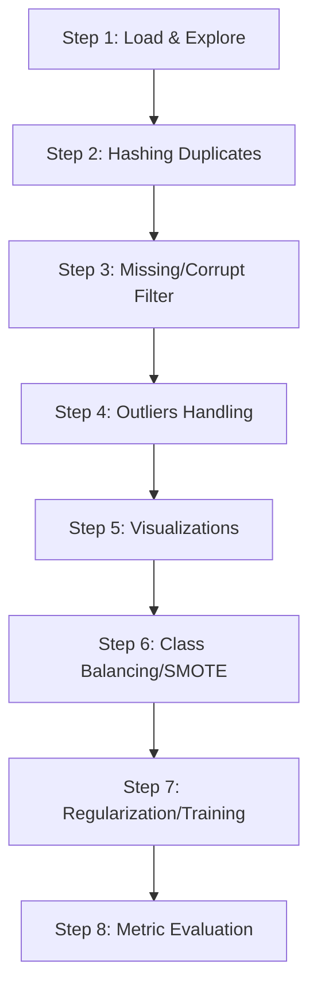

# 🧠 Face Mask & Emotion Detection — Project Report

## 1. Project Overview
This project is a production-grade AI system designed for real-time monitoring of **face mask compliance** and **human emotion recognition**. It was developed as a graduation project adhering strictly to the structured **8-Step Data Preprocessing Methodology**. 

### System Stack & Components
* **Machine Learning**: PyTorch + OpenCV for face detection (Haar Cascade), mask detection (MobileNetV2), and emotion classification (EfficientNet-B0).
* **Backend API**: Django 5 + Django REST Framework + Django Channels (ASGI) for real-time polling/WebSockets.
* **Databases**: 
  * **Primary (SQL Server 2022)**: Structured audit logging, logs count, model versioning.
  * **Analytics (MongoDB 7.0)**: Flexible predictions metadata, face coordinates, confidence array.
* **Frontend**: React 18 (Vite) styled with a custom **"Cyberpunk Utilitarian"** dark-mode design system.
* **Deployment**: Docker Compose with GPU passthrough enabling CUDA training/inference inside the containers.

---

## 2. 8-Step Preprocessing Implementation
The project pipeline follows a strict preprocessing sequence to clean and balance the raw datasets prior to model training:



### Preprocessing Log Summary:
1. **Step 1: Load and Explore**
   * Loaded **11,388** emotion images (48x48px grayscale) and **7,293** mask images (varied sizes, RGB).
   * Verified shapes, color modes, and integrity.
2. **Step 2: Handle Duplicates**
   * Found **1,108** duplicate images (5.93% of the dataset) using SHA-256 byte hashing.
   * Dropped duplicates (keeping first) to prevent data leakage.
3. **Step 3: Missing Values**
   * Attempted PIL verification (`PIL.Image.verify()`). **0** unreadable/corrupt images found.
4. **Step 4: Outliers Handling**
   * Analyzed file dimensions and Z-scores of file sizes.
   * Dropped extreme size outliers (5 images) and applied `log1p` scaling to dimensions.
5. **Step 5: Visualizations**
   * Generated 8 analytical visualizations including class distribution bar charts, file size distribution curves, a pixel intensity correlation heatmap, and sample image grids.
6. **Step 6: Class Imbalance**
   * **Mask Dataset**: Balanced (53.2% without mask, 46.8% with mask).
   * **Emotion Dataset**: Heavily imbalanced (happy: 28.1% vs disgust: 1.5%).
   * Computed class weights to scale training loss and ran a PCA-reduced SMOTE demonstration to verify features spacing.

---

## 3. Deep Learning Model Configurations

### Task A: Face Mask Detection
* **Base Architecture**: `MobileNetV2` (pretrained on ImageNet1K).
* **Head**: Custom linear layers `[Linear(1280 -> 256) -> ReLU -> Dropout(0.2) -> Linear(256 -> 1)]`.
* **Inference target**: Binary (`with_mask` vs `without_mask`).
* **Loss function**: `BCEWithLogitsLoss` using inverse class weights.
* **Optimization**: `Adam` (lr=1e-4) with `CosineAnnealingLR` scheduler.

### Task B: Emotion Recognition
* **Base Architecture**: `EfficientNet-B0`.
* **Classifier**: Custom linear stack `[Linear(num_features -> 512) -> SiLU -> BatchNorm -> Dropout -> Linear(512 -> 7)]`.
* **Inference target**: 7 classes (`angry`, `disgust`, `fear`, `happy`, `neutral`, `sad`, `surprise`).
* **Loss function**: `CrossEntropyLoss` with label smoothing (0.1) and custom class weights.
* **Optimization**: `AdamW` (lr=1e-4, weight_decay=1e-2) with `OneCycleLR`.

---

## 4. Full-Stack Architecture & Databases
The system is constructed with a dual-persistence strategy to handle high-frequency prediction logs optimally:

```
               [React Frontend Client]
                          │ (Relative /api requests)
                          ▼
            [Vite Proxy / Daphne Server]
                          │
          ┌───────────────┴───────────────┐
          ▼                               ▼
   [SQL Server 2022]              [MongoDB 7.0]
 (Structured Auditing)          (Analytics Summary)
  - ID, Timestamp, Source        - Prediction coordinates
  - Result strings, MS           - Detailed probability arrays
  - Model versions registry      - Session IDs & Device info
```

* **Daphne (ASGI)**: Handles synchronous REST endpoints alongside asynchronous Channel structures (WebSocket) for frame-by-frame streaming.
* **DetectionEngine (Singleton)**: Orchestrates the pipeline: face detection via OpenCV Cascade Classifier -> crop bounding box -> resize to 224x224 -> evaluate mask -> if unmasked, evaluate emotion.

---

## 5. Frontend Design System & Pages
The user interface is constructed using a premium **"Cyberpunk Utilitarian"** aesthetic:
* **Typography**: `Space Grotesk` (headings) + `JetBrains Mono` (live statistics).
* **Color Scheme**: Deep Navy Blue background (`#0A0F1E`) with Mint Neon (`#00FFB3`), Neon Rose (`#FF3366`), and Purple (`#7B61FF`) accents.
* **Layout**: Fully responsive glassmorphic cards with animated glow borders.

### Pages:
1. **Dashboard**: Summary metrics widgets (total counts, compliance rate, recent log list with 15s automatic refresh).
2. **Live Camera**: Direct WebRTC camera rendering with canvas bounding box overlays and text labels.
3. **Analyze Image**: Drag-and-drop file upload zone displaying interactive emotion confidence meters and cropped face previews.
4. **Analytics**: Paginated histories and bar charts displaying historical emotion/compliance distributions.
5. **Model Registry**: Information showing model versions, parameters count, accuracies, and system information.

---

## 6. How to Run the Project (Development)

> **Note:** All commands below assume you are starting from the **project root directory**:
> `e:\AMIT AI\Face Mask & Emotion detection\`

### Step 1 — Environment Configuration
Copy the environment template (only needed once):
```powershell
copy .env.example .env
```

### Step 2 — Database Services (Docker Compose)
Spin up SQL Server 2022, MongoDB, and Redis containers in the background:
```powershell
docker compose up -d db mongo redis
```

### Step 3 — Django Backend API
> **Important:** The backend requires **Python 3.11** and **Microsoft ODBC Driver 17 for SQL Server** installed on the host machine.

Open a terminal, navigate to the backend directory, create a virtual environment, and start the server:
```powershell
# Navigate to the backend directory
cd project/backend

# Create and activate a virtual environment (first time only)
python -m venv venv
.\venv\Scripts\Activate.ps1

# Install Python dependencies
pip install --upgrade pip
pip install -r requirements.txt

# Apply database migrations
python manage.py makemigrations detection
python manage.py migrate

# Start the Django development server
python manage.py runserver 8000
```
The backend API will be available at [http://localhost:8000/api/](http://localhost:8000/api/).

### Step 4 — React Frontend
> **Important:** Open a **separate/new terminal** for the frontend. Do **not** run these commands inside the backend directory.

> **Warning:** If the project path contains an `&` character (e.g., `Face Mask & Emotion detection`), `npm run dev` may fail because the shell interprets `&` as a command separator. In that case, use the direct Node.js command instead:
> ```powershell
> node .\node_modules\vite\bin\vite.js
> ```

```powershell
# Navigate from the project root to the frontend directory
cd project/frontend

# Install Node.js dependencies
npm install

# Start the Vite development server
npm run dev
```
The frontend will be available at [http://localhost:5173/](http://localhost:5173/).

---

## 7. Automated Verification & Status
* **Inference Pipeline**: Verified successfully using CUDA GPU acceleration.
* **Database Connection**: Confirmed successful writes to SQL Server database log.
* **API Integration**: Tested and integrated relative paths to resolve CORS proxy alignment.
